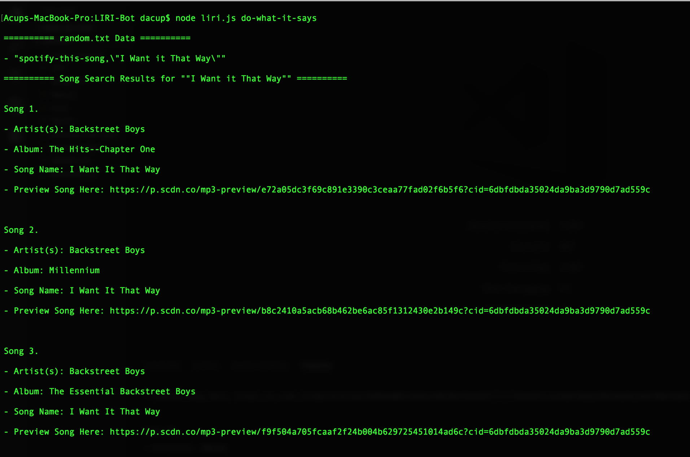

# LIRI Bot

LIRI Bot is a Node.js based application allowing users to access different API's through the terminal / git bash window.  Users can do the following: enter a screen name into the "my-tweets" command to get access to specific tweets, enter a song title into the "spotify-this-song" command to search songs, enter a movie name into the "movie-this" command to search movies, or enter the command "do-what-it-says" to have the Node.js file system read a txt file and apply what every commmand is inside of theat files to the applications functionality.  The app makes use of the Spotify, Twitter, and OMDB APIs.

## Getting Started

These instructions will get you a copy of the project up and running on your local machine for development purposes.

### Prerequisites

What things you need to install the software and how to install them

```
* [Javascript](https://www.javascript.com/)
* [Node.js](https://nodejs.org/en/)
* Terminal (Mac) / Git Bash (PC)
```

### Installing

A step by step series of examples that tell you how to get a development env running

* Install the prerequisites on your computer

```
* Javascript
* Node.js
* Terminal (Mac) / Git Bash (PC)
```

* Use terminal / git bash to run npm install for required npm packages (dotenv, node-spotify-api, request, twitter)

```
* $ npm install
```

* Use terminal / git bash to run the application with Node.js

```
* $ node liri.js my-tweets "YOUR_SCREEN_NAME"
* $ node liri.js movie-this "YOUR_MOVIE_TITLE"
* $ node liri.js spotify-this-song "YOUR_SONG_NAME"
* $ node liri.js do-what-it-says
```

## Photo examples of the app running

* Twitter Command


* Spotify Command


* OMDB Command


* Node.js File System Command




## Built With

* [Javascript](https://www.javascript.com/)
* [Node.js](https://nodejs.org/en/)
* [Twitter API](https://www.npmjs.com/package/twitter)
* [Request.js](https://www.npmjs.com/package/request)
* [Node-Spotify-api](https://www.npmjs.com/package/node-spotify-api)
* [OMDB API](http://www.omdbapi.com/)

## Code Editor: 

* [Visual Studio Code](https://code.visualstudio.com/)

## Authors 

* **Dylan Acup** - [Portfolio](dylanacup.com)
